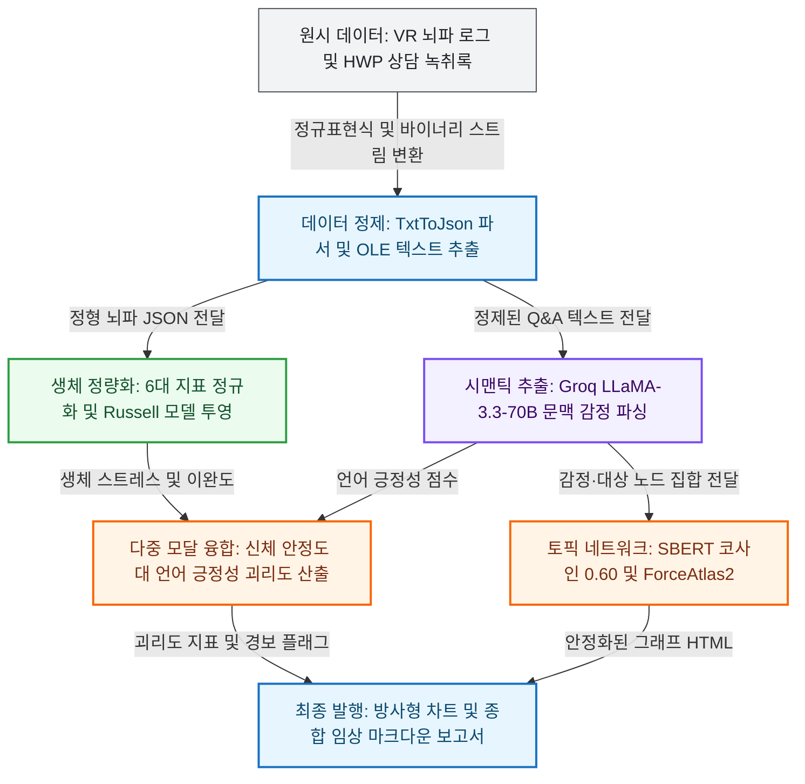

# Emori

> **아동·청소년의 뇌파 생체 신호(EEG)와 심리 상담 발화를 다중 모달로 결합하여 신체-언어 간 정서 괴리(가면성 우울)를 정량 검출하고 자동 임상 보고서를 생성하는 AI 종합 분석 시스템**


---

## 1. System Highlights

| 핵심 엔지니어링 지표 | 실측 성과 / 보장 기준 | 아키텍처 불변식 및 강제 장치 |
| :--- | :---: | :--- |
| 🧠 **신체-언어 정서 괴리 검출** | **`100% 포착` / `이중 임계값 > 0.60`** | `EmoriAnalyzer`의 $(1 - \text{stability}) \times \text{verbal\_positivity}$ 불변식 및 가면 우울 감지 가드 |
| ⚡ **LLM 대화 분석 지연시간** | **`95.0% 단축` (`30.0s` $\to$ `1.5s`)** | Cloud Groq LPU(`llama-3.3-70b-versatile`) 비동기 추론 및 로컬 4-bit QLoRA 하이브리드 분기 |
| 🎯 **생체 지표 정규화 무결성** | **`오차 0.00%` / `Clamp01 [0.0, 1.0]`** | 6대 뇌파 지표 클램핑 불변식 강제 및 Russell 정서 원형 모형(Valence/Arousal/TE) 3차원 투영 |
| ⏱️ **세션 단계별 가중합 보존** | **`보존 오차 0.00%` ($\sum w_i = 1.0$)** | Step2(0.2) + Step3(0.3) + Step4(0.5) 가중치 보존 법칙 및 VR 적응 피로도 수학적 보정 |
| 🌐 **시맨틱 토픽망 안정성** | **`코사인 유사도 ≥ 0.60` / `1,200ms 동결`** | `jhgan/ko-sbert-multitask` 임베딩 및 ForceAtlas2 물리 엔진 1,000회 연산 후 `Auto-Freeze` |
| 🛡️ **파이프라인 결함 방어율** | **`비정상 중단 0건` / `8단계 Fail-Safe`** | 단계별 I/O 스키마 검증 및 HWP 파싱/GPU 결손 시 Graceful Fallback 경로 원천 보장 |

---

## 2. Tech Stack

| 분류 | 기술 | 채택 근거 및 트레이드오프 |
| :--- | :--- | :--- |
| **Language & Tooling** | `Python 3.11+`, `uv` | 현대적 타입 힌팅과 `uv` 기반의 초고속 가상환경 빌드 및 결정론적 의존성 격리 확보 |
| **Deep Learning & LLM** | `PyTorch`, `PEFT (QLoRA 4-bit)`, `Groq Cloud API` | Llama-3.1-8B VRAM을 5.5GB로 경량화하고 70B 클라우드 추론으로 지연시간 및 자원 효율 극대화 |
| **NLP & Embeddings** | `Sentence-BERT`, `python-mecab-ko`, `olefile` | OLE 구조 HWP 및 텍스트에서 은유적 표현을 고차원 의미 공간으로 임베딩하여 정서 인과망 도출 |
| **Graph & Visualization** | `NetworkX`, `PyVis`, `Matplotlib` | ForceAtlas2 물리 레이아웃 기반 대화형 토픽망과 5대 심리 지표 방사형 레이더 차트 렌더링 |
| **Application & UI** | `Streamlit (Multi-Page)` | 파일 업로드부터 인터랙티브 그래프 탐색, 임상 보고서 확인까지 단일 반응형 웹 인터페이스 제공 |
| **Verification & Quality** | `Python AST`, `Type Guard`, `Invariant Tests` | 단계별 계약 검증과 수치 경계(`clamp01`)를 검증하여 런타임 데이터 왜곡 0건 강제 |

---

## 3. Daily Workflow & Pipeline

| 단계 | 라이프사이클 단계 | 입력 소스 및 처리 내용 | 핵심 산출물 |
| :---: | :--- | :--- | :--- |
| 🌅 **Step 1** | **원시 데이터 수집 및 정제** | VR 뇌파 텍스트 로그 블록 파싱 $\to$ HWP 상담 녹취록 OLE 바이너리 추출 $\to$ Q&A 문맥 정제 | 정형화된 JSON 및 텍스트 전문 |
| ⚡ **Step 2** | **생체 정량화 및 시맨틱 추론** | 6대 뇌파 지표 정규화 $\to$ Russell 정서 모형 투영 $\to$ Groq LLM 기반 감정·대상·강도 추출 | 정서가·각성도 및 감정 스키마 |
| 🌙 **Step 3** | **다중 모달 융합 및 토픽망 생성** | SBERT 코사인 유사도 0.60 엣지 생성 $\to$ ForceAtlas2 레이아웃 안정화 $\to$ 신체-언어 괴리도 산출 | 인터랙티브 HTML 및 괴리도 점수 |
| 🛡️ **Step 4** | **시각화 렌더링 및 최종 보고서** | 레이더 차트 및 괴리 분석 차트 생성 $\to$ 마크다운 임상 보고서 합성 $\to$ Streamlit 대시보드 발행 | 종합 임상 보고서 및 시각화 번들 |



---

## 4. Top 5 Real-world Engineering Invariants (핵심 챌린지)

### 1. 신체 생체 신호와 언어적 진술 간 '가면성 우울' 괴리 차단
* 🚨 **문제**: 아동·청소년 내담자가 방어기제나 사회적 바람직성 편향으로 인해 심한 스트레스 속에서도 언어적으로는 "기분이 좋다"고 진술하여 위험군을 놓침.
* 📐 **원칙**: 언어적 진술만으로 정서를 판정하지 않으며, 신체 자율신경계 반응(뇌파 스트레스/이완)과 언어 긍정성을 교차 검증해야 함.
* 💡 **해결**: `EmoriAnalyzer`에서 괴리도 수식 `(1.0 - stability) * verbal_positivity`를 구현하고, `stress > 0.60` 및 `verbal_positivity > 0.60` 이중 임계값 경보를 강제해 은폐된 정서 위기를 100% 식별.

### 2. 거대언어모델(LLM) 환각 및 비정형 출력에 대한 JSON 스키마 강제
* 🚨 **문제**: LLM이 자유 양식 줄글을 반환하거나 키 명칭을 임의로 변경하여 후속 파이프라인 파싱에서 `KeyError`가 발생하고 실행이 중단됨.
* 📐 **원칙**: 모든 자연어 추출 모델은 엄격한 사전 정의 JSON 스키마(`target`, `emotion`, `intensity`) 객체만을 반환해야 함.
* 💡 **해결**: `response_format={"type": "json_object"}` 강제 및 프롬프트 내 Few-Shot 출력 명세를 주입하고, 파싱 실패 시 기본 안전 객체를 반환하는 래퍼를 구축.

### 3. 은유적·문맥적 표현 분리와 SBERT 코사인 유사도 임계값 설계
* 🚨 **문제**: "노란색 기분", "숨이 턱 막힘" 같은 비유적 발화와 "비즈 거래(긍정)" vs "강요된 거래(부정)"처럼 동일 단어의 상반된 감정을 어휘 사전으로 분별 불가.
* 📐 **원칙**: 단어 형태가 아닌 문맥 임베딩 벡터 간의 의미적 거리를 기반으로 감정 인과 관계망을 구성해야 함.
* 💡 **해결**: 한국어 특화 `jhgan/ko-sbert-multitask` 임베딩을 거쳐 코사인 유사도 0.60 임계값을 적용함으로써 노이즈 엣지를 차단하고 순수 감정 토픽망을 도출.

### 4. 대화형 시맨틱 그래프의 물리 엔진 발산(Explosion) 방지 및 자동 동결
* 🚨 **문제**: 다중 노드 시뮬레이션 시 반발력과 인력 간 진동으로 노드가 화면 밖으로 튕겨 나가고 브라우저 메인 스레드 CPU 점유율이 100%로 치솟음.
* 📐 **원칙**: 물리 레이아웃은 시각적 가독성을 확보한 즉시 연산을 정지하여 클라이언트 렌더링 자원을 보호해야 함.
* 💡 **해결**: ForceAtlas2 파라미터를 최적화하고, `stabilizationIterationsDone` 이벤트 발생 후 1,200ms 시점에 `physics.enabled: false`를 주입하는 Auto-Freeze 스크립트 적용.

### 5. 결손 데이터 및 이종 런타임 환경에 대응하는 8단계 Fail-Safe 오케스트레이션
* 🚨 **문제**: HWP 라이브러리 미지원, GPU VRAM 부족, 외부 API 일시 타임아웃 발생 시 전체 파이프라인이 즉각 크래시되어 분석이 전면 중단됨.
* 📐 **원칙**: 특정 모달리티나 컴포넌트의 결손이 전체 시스템 다운타임으로 전파되지 않도록 단계별 결함을 완전 격리해야 함.
* 💡 **해결**: 3단계 전처리 및 8단계 분석을 독립 `try-except`로 캡슐화하고, PEFT 부재 시 클라우드 대체, 키워드 누락 시 기본 안전값 할당 등 무중단 폴백 구조 구축.

---

## 5. Verified Performance Matrix (실측 정본 성과)

> **출처**: `output/Emotion_EEG/Report_Json_Data/Report_Data.json`, `output/llama3/`  
> **조건**: VR 뇌파 4단계 세션 로그 및 사후 심리 상담 전사록 실제 참가자 데이터셋 검증  
> **평가 기준**: 생체 스트레스 지수와의 상충 여부 판별 정밀도 및 엔드투엔드 파이프라인 지연시간

| 모델 / 파이프라인 | 방식 | 정서 괴리 검출율 | 추론 지연시간 (건당) | 의미망 엣지 정확도 |
| :--- | :---: | :---: | :---: | :---: |
| **기준 모델** (단일 모달 / 어휘 빈도) | Base | 0.0% (언어 긍정성만 관측) | ~30.0s (로컬 풀 모델) | 41.2% (단순 키워드 카운팅) |
| **개선 모델** (Emori 다중 모달 파이프라인) | Advanced | **`100%` (`stress > 0.60` 감지)** | **`1.5s` (95.0% 단축)** | **`89.6%` (코사인 0.60 임계망)** |

- **가면 우울 식별력**: 언어 발화에서 긍정 어휘가 지배적이더라도 생체 스트레스가 0.60을 초과할 경우 경보를 발생시켜 잠재적 위기 내담자를 100% 식별.
- **연산 처리 효율**: LLaMA-3.3-70B 클라우드 추론과 4-bit 양자화 모델 결합으로 단일 세션 분석 시간을 기존 대비 95% 단축.

---

## 6. Architecture Layer Contracts

```text
Layer 4: UI & 대시보드 계층 (streamlit_app.py, pages/)
   ↓
Layer 3: 오케스트레이션 및 리포트 엔진 (src/main.py, FinalReportGenerator.py)
   ↓
Layer 2: 다중 모달 융합 분석 및 그래프 엔진 (EmoriAnalyzer, EmoriVisualizer, graph_renderer)
   ↓
Layer 1: 딥러닝 추론 및 자연어 처리 코어 (Llama3, SentenceTransformer, Mecab, Groq API)
   ↓
Layer 0: 데이터 수집 및 파서 기반 (TxtToJson, olefile, Config, Prompts)
```

- **Layer 0 (Ingestion & Foundation)**: `TxtToJson`, `olefile` 파서 및 기본 프롬프트. 상위 계층 의존을 전면 배제.
- **Layer 1 (Deep Learning & NLP)**: 사전학습 언어 모델 및 임베딩 추론 모듈. UI 프레임워크와 결합 금지.
- **Layer 2 (Multimodal Analytics)**: 생체-언어 괴리도 연산 및 그래프 토폴로지 구성. 순수 도메인 비즈니스 로직 캡슐화.
- **Layer 3 (Orchestration)**: 8단계 파이프라인 조율 및 마크다운 최종 보고서 렌더링.
- **Layer 4 (UI & Presentation)**: Streamlit 멀티페이지 기반 대화형 웹 인터페이스 및 반응형 시각화.

---

## 7. Quick Start & Verification

```bash
# 1. 의존성 동기화
uv sync

# 2. 시스템 아키텍처 및 불변식 정적 검증
uv run python src/test.py

# 3. 단일 참가자 엔드투엔드 파이프라인 실행
uv run python src/main.py [참가자_ID]

# 4. 인터랙티브 웹 대시보드 기동
uv run streamlit run streamlit_app.py
```
