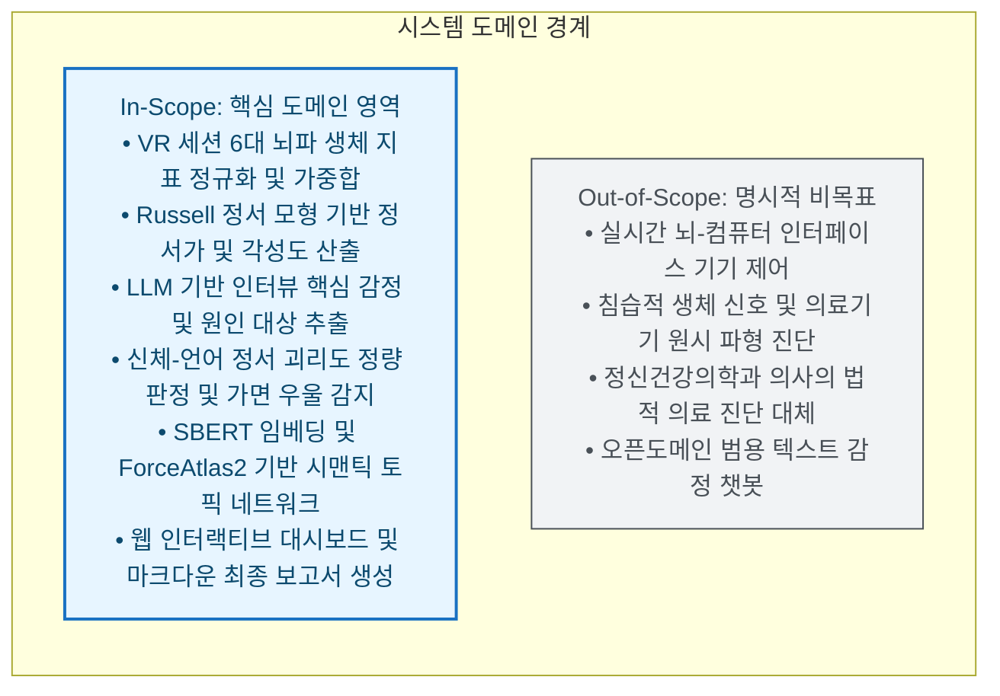
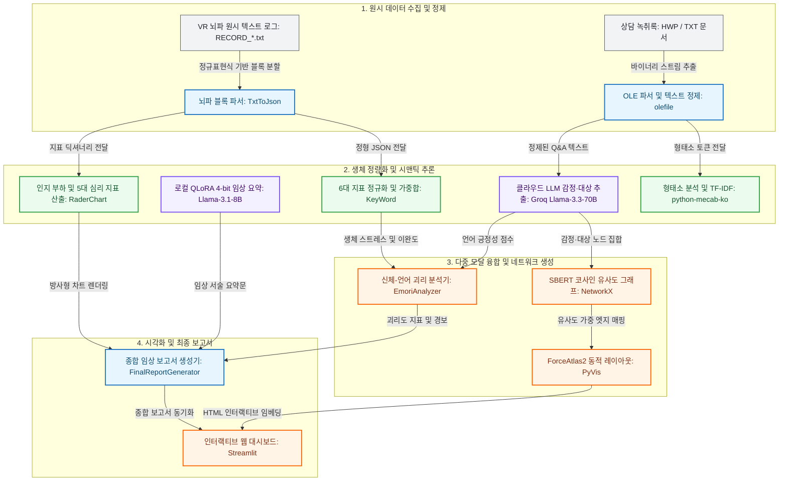
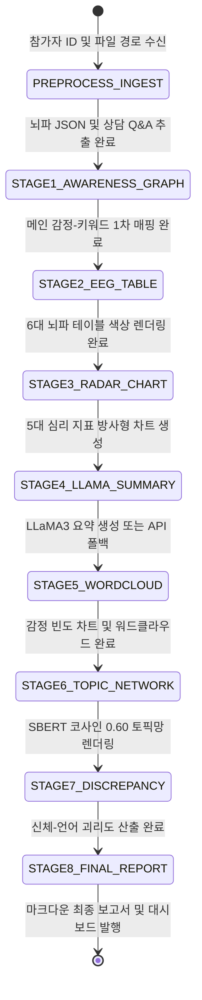

# System Design Specification

> **아동·청소년 정서 분석을 위한 뇌파 생체 신호(EEG) 및 상담 발화 다중 모달 결합, 정서 괴리 검출 및 자동 임상 보고서 시스템 설계 명세**

---

## 1. System Objectives & Scope Boundaries

Emori는 VR 환경에서 수집된 뇌파 생체 신호(EEG)와 사후 심리 상담 발화(인터뷰) 데이터를 융합하여, 아동·청소년의 무의식적 신체 반응과 언어적 표현 간 괴리(Discrepancy)를 정량화하고 임상적 통찰을 제공하는 다중 모달 정서 분석 시스템입니다.



### 1.1 In-Scope (핵심 도메인 범위)
- **VR 세션 다단계 뇌파 생체 지표 정규화**: 6가지 뇌파 지표(`stress`, `engage`, `relax`, `excite`, `interest`, `focus`)를 `clamp01` 불변식으로 정규화하고, VR 진행 단계별 가중합(`step2: 0.2`, `step3: 0.3`, `step4: 0.5`)을 통해 세션 적응 피로도를 보정한 종합 심리 지표 산출.
- **Russell 정서 원형 모형(Circumplex Model) 투영**: 다차원 뇌파 신호를 정서가(Valence, 쾌·불쾌)와 각성도(Arousal, 활성화 수준), 과제 몰입도(Task Engagement)의 임상 지표로 변환.
- **LLM 기반 정서·원인 대상(Target) 추출**: 상담 전사록에서 문맥적 주어/목적어 복원 및 은유적 표현을 해석하여 대상별 감정 및 강도(`intensity: 0.00 ~ 1.00`)를 정형 JSON으로 구조화.
- **신체-언어 정서 괴리도(Discrepancy Score) 정량화**: 뇌파 기반 정서 안정도와 상담 발화의 언어적 긍정성을 교차 검증하여, 겉으로는 밝게 말하지만 신체는 스트레스를 겪는 가면성 우울(Smiling Depression) 징후 감지.
- **시맨틱 토픽 네트워크 및 자동 보고서 발행**: SBERT 코사인 유사도 기반 동적 그래프 생성과 ForceAtlas2 레이아웃 안정화, 통합 마크다운 보고서 및 대시보드 시각화.

### 1.2 Out-of-Scope (명시적 비목표)
- **실시간 BCI(Brain-Computer Interface) 제어**: 뉴로피드백 실시간 하드웨어 제어는 배제하며, 세션 완료 후 수집된 로그 기반의 후행 심층 분석에 집중.
- **의료법상 공식 의학적 진단**: 본 시스템은 임상 심리 상담사의 정서 평가를 보조하는 정량적 분석 도구이며, 단독 의료 진단을 내리지 않음.
- **범용 챗봇 에이전트**: 일반 대화 생성이 아닌, 상담 전사록 구조화 및 임상 서술 요약에 특화된 엔지니어링 파이프라인 유지.

---

## 2. Component Topology & Multi-Modal Interfaces

시스템은 데이터 수집부터 최종 보고서 생성까지 모듈 간 결합도를 최소화하고 인터페이스 계약을 표준화한 5단계 토폴로지로 구성됩니다.



### 2.1 주요 컴포넌트 규격
- **TxtToJson (`src/Emotion_EEG/TxtToJson/TxtToJson.py`)**: 정규표현식(`re.findall`)을 사용하여 다단계 VR 세션 블록(`STEP.prestep`, `STEP.step2`, `step3`, `step4`)에서 6대 뇌파 지표(`PM_Stress`, `PM_Engage`, `PM_Relax`, `PM_Excite`, `PM_Interest`, `PM_Focus`)를 추출하고 참가자별 표준 JSON 스키마로 변환.
- **KeyWord & RaderChart (`src/Emotion_EEG/`)**:
  - `Valence = (excite + interest + engage - stress) / 4.0`
  - `Arousal = (excite + engage + focus - relax) / 3.0`
  - `Task Engagement = sqrt(max(0, engage) * max(0, focus))`
  - `인지 부하 = (stress + (1 - relax)) / 2.0`
- **EmoriAnalyzer (`src/module/EmoriAnalyzer.py`)**:
  - `stability = (relax + (1.0 - stress)) / 2.0`
  - `discrepancy = (1.0 - stability) * verbal_positivity`
  - 이중 임계값 경보: `stress > 0.60` 및 `verbal_positivity > 0.60` 만족 시 가면 우울 의심 플래그 활성화.
- **SBERT & ForceAtlas2 (`src/graph_renderer.py`, `src/emotion-interview_relation/`)**: `jhgan/ko-sroberta-multitask` 및 `ko-sbert-multitask` 임베딩, 코사인 유사도 0.60 이상 엣지 연결, 1,000회 물리 연산 후 1,200ms 경과 시 Auto-Freeze로 브라우저 자원 보호.

---

## 3. End-to-End Orchestration Lifecycle

시스템은 `src/main.py`를 중심으로 3단계 전처리 및 8단계 본 분석 파이프라인을 순차 집행하며, 부분 결측 시 전체 작업이 중단되지 않도록 Graceful Fallback 라이프사이클을 유지합니다.



### 파이프라인 단계별 계약 및 결함 격리 정책
1. **EEG 데이터 변환 (`preprocess_eeg_data`)**: `RECORD_*.txt` 누락 시 경고 로그 후 기존 캐시된 `Report_Data.json` 재사용.
2. **상담 분석 (`preprocess_interview_doheon`, `hyunwoo`)**: `GROQ_API_KEY` 부재 시 기본 긍정성 점수(0.50)와 빈 분석 결과를 반환하여 후속 차트 렌더링 보존.
3. **로컬 LLaMA3 추론 (`step4_eeg_summary`)**: GPU VRAM 부족 또는 PEFT 모듈 미설치 시 에러 중단 없이 클라우드 요약 또는 안내 메시지로 즉시 우회.
4. **괴리도 분석 및 시각화 (`step7_eeg_interview_consistency`)**: 산출 결과 이미지(`*_discrepancy.png`)가 이미 존재할 경우 불필요 연산 스킵(멱등성 보장).
5. **최종 보고서 발행 (`step8_final_report`)**: 참가자 ID 매칭 실패 시 첫 번째 유효 참가자 키를 지능적으로 탐색하는 3단계 폴백 적용.

---

## 4. Domain Bio-Psychological Integrity Barriers

임상 심리 및 뇌파 분석의 왜곡을 원천 차단하기 위해 4대 도메인 무결성 배리어를 강제합니다.

### 4.1 생체 지표 클램핑 배리어 (Clamp01 Barrier)
센서 노이즈나 측정 이상치로 인해 뇌파 지표가 비정상적인 범위를 갖지 않도록, 모든 수치 연산 진입점에서 $[0.0, 1.0]$ 구간 클램핑을 강제합니다:
$$\text{clamp01}(x) = \max(0.0, \min(1.0, x))$$

### 4.2 세션 시계열 가중치 보존 배리어 (Step Weight Conservation)
VR 체험 초기 긴장 상태(Step2, 20%), 본격 몰입 과제(Step3, 30%), 마무리 안정화(Step4, 50%)의 단계별 심리 변화를 반영하며, 가중치 총합은 항상 1.0을 엄수합니다:
$$\sum_{i \in \{\text{step2, step3, step4}\}} w_i = 0.2 + 0.3 + 0.5 = 1.0$$

### 4.3 가면 우울 이중 임계 배리어 (Discrepancy Dual-Threshold)
단순 발화 긍정성만으로 내담자의 정서를 오판하지 않도록 생체 스트레스와 언어 긍정성의 교차 임계 조건을 강제합니다:
$$\text{Warning Flag} = (\text{stress} > 0.60) \land (\text{verbal\_positivity} > 0.60)$$
해당 조건 충족 시 임상 상담사에게 정서 방어 기제 및 잠재적 우울 가능성을 즉각 통보합니다.

### 4.4 그래프 안정화 경계 (Graph Stabilization Boundary)
PyVis/Vis.js ForceAtlas2 물리 엔진의 노드 발산(Node Explosion)을 방지하기 위해 1,000회 반복 연산 완료 후 1,200ms 경과 시 `physics.enabled: false`를 강제하여 브라우저 스레드를 동결합니다.

---

## 5. Strict Architecture Layer Contracts

시스템은 상위 계층이 하위 계층에만 의존하며 역방향 참조가 발생하지 않도록 5계층 위계를 준수합니다.

```text
Layer 4: UI & Dashboard Layer (streamlit_app.py, pages/)
   ↓
Layer 3: Orchestration Layer (src/main.py, FinalReportGenerator.py)
   ↓
Layer 2: Multimodal Analytics & Graph Layer (EmoriAnalyzer, EmoriVisualizer, graph_renderer)
   ↓
Layer 1: Deep Learning & NLP Core (Llama3, SentenceTransformer, Mecab, Groq API)
   ↓
Layer 0: Ingestion & Parser Foundation (TxtToJson, olefile, Config, Prompts)
```

- **Layer 0 (Ingestion & Foundation)**: 파일 I/O, 정규표현식 파싱, 프롬프트 템플릿 정의. 상위 계층에 의존하지 않음.
- **Layer 1 (Deep Learning & NLP)**: 사전학습 모델 로딩, 토큰화, API 클라이언트 연동. 순수 도메인 분석 로직을 포함하지 않음.
- **Layer 2 (Analytics & Graph)**: 생체-언어 융합 연산, 네트워크 그래프 토폴로지 구성, 차트 렌더링. UI 프레임워크와 완전 분리.
- **Layer 3 (Orchestration)**: 참가자 ID 기반 8단계 파이프라인 스케줄링 및 최종 보고서 합성.
- **Layer 4 (UI & Presentation)**: Streamlit 기반 웹 인터페이스. 하위 분석 모듈을 호출하여 결과를 반응형으로 렌더링.
